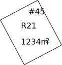
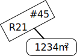

# Rakentamisen määrä ja sijoittaminen
{:.no_toc}

1. 
{:toc}

## Sallittu kerrosala

Kaavamääräyslji on kuvattu koodiston [Kaavamääräyslaji (asemakaava)](http://uri.suomi.fi/codelist/rytj/RY_KaavamaaraysLaji_AK) koodina [0301](http://uri.suomi.fi/codelist/rytj/RY_KaavamaaraysLaji_AK/code/0301).

Sallittu kerrosala -kaavamääräystä käytetään kaavakohteen alueelle sijoitettavien rakennusten suurimman sallitun kokonaiskerrosalan tai sallitun kokonaiskerrosalan vähimmäis- ja enimmäisarvojen määräämiseen. Määräyksen lisätietona voidaan lisäksi niin haluttaessa jyvittää annettu kokonaiskerrosala käyttötarkoituksittain joko kerrosneliömetreinä tai suhteellisesti prosenttiyksikköinä kokonaiskerrosalasta. 

Sallittu kerrosala lajin kaavamääräys voidaan liittää mihin tahansa kaavakohteeseen, jonka rajaamalla alueella halutaan määrätä rakennusten kerrosalasta. 

Määräykseen liittyvät [Asemakaavan soveltamisprofiilin](https://tietomallit.ymparisto.fi/kaavatiedot/asemakaava/v1.0/soveltamisprofiili/) vaatimukset: 

* [prof-ak/vaat-sallittu-kerrosala-arvot](https://tietomallit.ymparisto.fi/kaavatiedot/asemakaava/v1.0/soveltamisprofiili/rakentamisen-maara-sijoittaminen/#prof-ak-vaat-sallittu-kerrosala-arvot) 

* [prof-ak/vaat-sallittu-kerrosala-lisatiedot](https://tietomallit.ymparisto.fi/kaavatiedot/asemakaava/v1.0/soveltamisprofiili/rakentamisen-maara-sijoittaminen/#prof-ak-vaat-sallittu-kerrosala-lisatiedot) 

### Kerrosala rakennusoikeuden mittana
Kerrosalaa on vain rakennuksessa. Rakennuksena ei pidetä kooltaan vähäisiä ja kevytrakenteisia rakennelmia tai pienehköjä laitoksia, jollei niillä ole erityisiä maankäytöllisiä tai ympäristöllisiä vaikutuksia. Ministeriön opasjulkaisussa 72/2000 Kerrosalan laskeminen on kohdassa 2.1 selvitetty rakennuksen käsitettä. Alueella, jonka asemakaava on hyväksytty 1.1.2000 jälkeen, kerrosala määritetään kerrosalan laskemissäännöksen ([MRL 115 §](https://www.finlex.fi/fi/laki/ajantasa/1999/19990132#L16P115)) mukaan seuraavasti:

> Tontin tai rakennuspaikan kerrosalalla tarkoitetaan sille rakennettaviksi sallittujen rakennusten yhteenlaskettua kerrosalaa.
>
> Rakennuksen kerros sijaitsee kokonaan tai pääasiallisesti maanpinnan yläpuolella, kellarikerros kokonaan tai pääasiallisesti maanpinnan alapuolella ja mahdollinen ullakko pääasiallisesti julkisivun ja vesikaton leikkauslinjan tasoa ylempänä kerroksen yläpuolella. Asemakaavassa voidaan sallia useamman kuin yhden kellarikerroksen rakentaminen sekä rakennuksen pääasiallisen käyttötarkoituksen mukaisten tilojen sijoittaminen maanpinnan alapuolelle tai ullakon tasolle.
>
> Rakennuksen kerrosalaan luetaan kerrosten alat ulkoseinien ulkopinnan mukaan laskettuina ja se kellarikerroksen tai ullakon ala, johon sijoitetaan tai voidaan näiden tilojen sijainnista, yhteyksistä koosta, valoisuudesta ja muista ominaisuuksista päätellen sijoittaa rakennuksen pääasiallisen käyttötarkoituksen mukaisia tiloja. Jos ulkoseinän paksuus on enemmän kuin 250 millimetriä,saa rakennuksen kerrosala ylittää muutoin sallitun kerrosalan tästä aiheutuvan pinta-alan verran.

Kerrosala koskee laissa määriteltyjä rakennuksia ([MRL 113 §](https://www.finlex.fi/fi/laki/ajantasa/1999/19990132#L16P113)) ja pääosin kerroksia sekä pääasiallisen käyttötarkoituksen mukaisia tiloja myös ullakolla ja kellarikerroksessa.

Kerrosalan laskemistapaa on tarkemmin selostettu edellä mainitussa oppaassa luvussa 3 Kerrosalan laskeminen. Siinä esitetään miten kerrosala määritetään, kun kysymyksessä on
rakennuksen pääasiallisen käyttötarkoituksen mukainen tila tai muu tila, esimerkiksi asuinrakennuksen aputila. Oppaassa käsitellään kerrosalan laskemista myös niillä alueilla, joiden
kaava on hyväksytty ennen 1.1.2000.

Kaikille tontilla tai rakennuspaikalla sijaitseville tai sijoitettaville rakennuksille lasketaan kerrosala. Rakennusten yhteenlaskettu kerrosala ei voi olla suurempi kuin tontille tai rakennuspaikalle sallittu kerrosala riippumatta siitä ilmaistaanko se tehokkuuslukuna, kerrosalaneliömetreinä tai käyttötarkoituksiltaan erilaisten kerrosalojen yhteenlaskettuna lukumääränä.
Rakennusluvan myöntämisen yhteydessä voidaan sallia kerrosalan ylitys siltä osin kun rakennuksen ulkoseinän paksuus on enemmän kuin 250 mm ([MRL 115.3 §](https://www.finlex.fi/fi/laki/ajantasa/1999/19990132#L16P115)).

Silloin kun asemakaavassa on osoitettu rakennusalat (ks. kohta 6.1 Rakennusala), rakennusoikeus voidaan ilmaista osoittamalla kullekin rakennusalalle sallittu kerrosalaneliömetreinä. Rakennusoikeus on syytä osoittaa kerrosalaneliömetreinä kullekin rakennusalalle myös silloin, kun olemassa olevaa rakennuskantaa pyritään säilyttämään, kysymyksessä on tiiviisti rakennettava alue taikka ympäristö- tai kaupunkikuvallisesti vaativa rakentaminen. [Tehokkuuslukumääräyksen](#tehokkuusluku) käyttö puolestaan sopii esimerkiksi kun kysymyksessä on paljon tontteja käsittävä pientaloalueen kaava.

### Käyttötarkoitukseltaan eritelty kerrosala
Tontin tai rakennuspaikan kerrosalan määrittämistä voidaan asemakaavassa tarkentaa ilmoittamalla se käyttötarkoitukseltaan eriteltyinä neliömetreinä, prosenttilukuina tai osista koostuvina lukusarjoina. Eri käyttötarkoituksiin varatut kerrosalat voidaan ilmoittaa koko korttelialuetta, tonttia tai rakennuspaikkaa koskevina tai rakennusalakohtaisesti.

Kun pääasiassa asuinrakennuksille varatulle korttelialueelle halutaan sijoittaa muitakin kuin asumiseen liittyviä tiloja, rakennusoikeus voidaan jakaa esimerkiksi käytettävissä olevan asuntokerrosalan, mahdollisen liiketilan sekä asukkaiden palvelu- ja yhteistiloille tarkoitetun kerrosalan kesken.

Kun asukkaiden yhteistiloille varataan erikseen kerrosalaa, voidaan tällaiset harrastus-, sauna- ja pesulatilat sekä talousvarastot sijoittaa asuinkerroksiin, mikä asumisviihtyisyyden
vuoksi saattaa olla perusteltua. Kellarikerroksessa tai ullakon tasolla sijaitessaan näitä ns. asuinrakennuksen aputiloja ei lueta kerrosalaan. Luhtikäytäville voidaan osoittaa myös kerrosalaa.

**Huomautus:** 
Käytettäessä käyttötarkoitukseltaan eriteltyä kerrosalaa on ko. kaavakohteeseen kohdistuttava myös kaavamääräys [Alueen käyttötarkoitus](../kayttotarkoitukset/#alueen-kayttotarkoitus) tai [Alueen osan käyttötarkoitus](../kayttotarkoitukset/#alueen-osan-kayttotarkoitus) siten, että erittelyssä käytetään vain niitä käyttötarkoituskoodeja, jotka ko. kaavakohteelle on määrätty käyttötarkoituksiksi, tai niiden tarkentavia alakoodeja.


### Harmonisoitu esitystapa - kaavakartta

[Kaavakartalla](../../../../yleista/termit/#kaavakartta) sallittu kerrosala esitetään numeromerkintänä, joka koostuu sen arvon sisältämästä lähimpään tasalukuun pyöristetystä arabialaista numerosta ja mittayksiköstä. Esimerkkikuvassa 1 tontille on määrätty sallittu kerrosala 1234 kerrosneliömetriä käyttäen yksittäistä [NumeerinenArvo](https://tietomallit.ymparisto.fi/kaavatiedot/v1.0/looginenmalli/dokumentaatio/#numeerinenarvo)-tyyppistä arvoa. Huomaa, että merkintä ```#45``` kuvaa [kaavakohteen numeroa](/yleista/kaavatietomalli/#kaavakohteet) 45 ja ```R21``` kohteeseen liitetyn [kaavamääräysryhmän](/yleista/kaavatietomalli/#kaavamääräysryhmät) numeroa 21. 


*Esimerkki 1: Sallittu kerrosala*

Mikäli numero ei mahdu luettavasti ko. kaavakohteen alueen sisään karttaesityksessä käytetyllä mittakaavalla, tai muiden merkintöjen vuoksi, se tulee ympyröidä pyöristetyllä rajausviivalla ja liitää ko. rajausviiva kaavakohteen alueeseen viivalla (esimerkkikuva 2).


*Esimerkki 2: Sallittu kerrosala - merkintä ei mahdu kaavakohteen geometrian sisään*





### Harmonisoitu esitystapa – kaavan määräyskokoelma
[Kaavan määräyskokoelmassa](../../../../yleista/termit/#kaavan-määräyskokoelma) sallittu kerrosala esitetään taulukkomuodossa.


















## Sallittu rakennustilavuus

Teollisuus- ja varastorakennusten korttelialueella, jossa sijaitsee suuria rakennuksia, saattaa olla tarkoituksenmukaista osoittaa rakennusoikeuden määrä myös kuutiometreinä. Muutoinkin rakennusoikeuden määrittäminen ja osoittaminen kuutiometreinä tai enimmäiskorkeuden ja rakennusalan avulla on usein tarkoituksenmukaista sellaisissa rakennuksissa, joissa kerroskorkeus on suuri tai jotka massoittelultaan ja luonteeltaan ovat esimerkiksi suuria yleisö- ja kokoontumistiloja sisältäviä halli- tai muita rakennuksia katsomoineen. Tämä rakennusoikeuden ilmaisutapa voi olla perusteltua myös niissä tapauksissa, joissa kyseessä ovat olemassa olevat rakennustaiteellisesti arvokkaat rakennukset tai sellaiset julkiset uudisrakennukset, joihin sisältyy erilaisia tavanomaisesta poikkeavia kerroskorkeuksia, avoimia auloja, valokatteisia tiloja, auditorioita, katsomoparvia ja vastaavia tiloja. Näin voidaan rakennusoikeus ilmaista myös silloin, kun rakennuksen nykyisen ulkoasun ja ulkomittojen säilyttäminen on tärkeää kaupunkikuvan tai korttelirakenteen kannalta. Tarvittaessa voidaan näissäkin tapauksissa lisäksi määrittää käyttötarkoitukseltaan eriteltyjä kerrosaloja.


## Tehokkuusluku


## Maanpäällinen kerrosluku

## Maanalainen kerrosluku


## Kellarin sallittu kerrosalaosuus


## Ullakon sallittu kerrosalaosuus


## Rakennuspaikkojen määrä

## Lisärakennusoikeus


## Rakentamisen suhde alueen pinta-alaan


## Etäisyys naapuritontin rajasta


## Rakennusala

## Rakennettava kiinni rajaan


## Rakennuspaikka


## Muu rakennusten sijoitukseen liittyvä määräys
